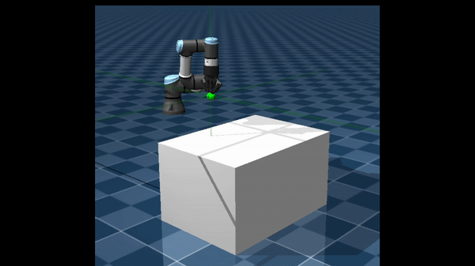
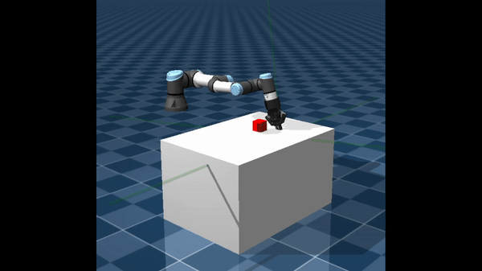
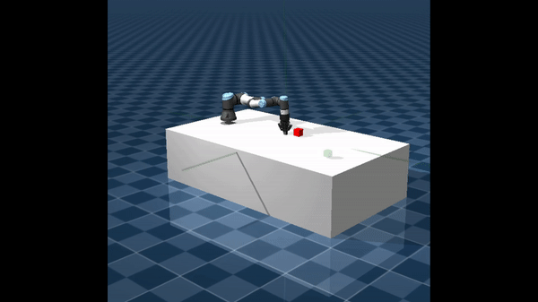
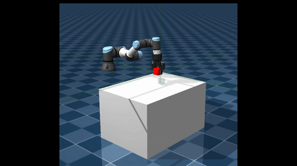

# UR3e Reinforcement Learning

Custom MuJoCo simulation environments for training and evaluating reinforcement learning policies on a **Universal Robots UR3e** with a **Robotiq 2F-85 gripper**.

The project provides custom Gymnasium goal-conditioned environments and an RL-Zoo3/Stable-Baselines3 training workflow for:

- **Reach**
- **Push**
- **Slide**
- **Pick-and-Place**

The main purpose of this repository is to make the **code, environments, training setup, and evaluation workflow reproducible**. 

---

<table>
<tr>
<td align="center" width="50%">

### Reach



</td>
<td align="center" width="50%">

### Push



</td>
</tr>
<tr>
<td align="center" width="50%">

### Slide



</td>
<td align="center" width="50%">

### Pick-and-Place



</td>
</tr>
</table>

## Table of Contents

* [Project overview](#project-overview)
* [Action space](#action-space)
* [Observation space](#observation-space)
* [Installation](#installation)

  * [Docker Setup](#docker-setup)
  * [Project Files and the `misis` Mount](#project-files-and-the-misis-mount)
  * [Verify GPU and PyTorch Setup](#verify-gpu-and-pytorch-setup)
* [Registering the environments](#registering-the-environments)
* [Training](#training)

  * [Useful training options](#useful-training-options)
  * [Weights & Biases (W&B)](#weights--biases-wb)
  * [Continuing training from a pretrained model](#continuing-training-from-a-pretrained-model)
* [Evaluation](#evaluation)
* [Hyperparameter Tuning](#hyperparameter-tuning)

  * [Optuna](#optuna)
* [TensorBoard](#tensorboard)
* [Long-running training with tmux](#long-running-training-with-tmux)
* [Troubleshooting](#troubleshooting)
* [Citation](#citation)
* [Acknowledgements](#acknowledgements)


---

## Project overview

The environments use a common robot/control interface while providing task-specific object and goal configurations.

| Environment | Description |
|---|---|
| **Reach** | Move the end-effector to a target position. |
| **Push** | Push a block across a table to a target. |
| **Slide** | Hit a block so that it slides toward a target. |
| **Pick-and-Place** | Pick up a block and move it to a target position. |

The simulation uses a **25 Hz control frequency**. MuJoCo advances with a 1 ms physics timestep, and each RL action is held for 40 physics steps.

---

## Action space

All environments use:

```text
Box(-1.0, 1.0, (4,), float32)
```

The four action values are:

```text
action[0] → Δx
action[1] → Δy
action[2] → Δz
action[3] → gripper open/close
```

The first three values control Cartesian displacement of the end-effector. The final value controls the Robotiq 2F-85 gripper.

The gripper command is internally rescaled from the normalized RL action range to the actuator range used by the simulated gripper.

---

## Observation space

The environments use a goal-conditioned dictionary:

```python
{
    "observation": ...,
    "achieved_goal": ...,
    "desired_goal": ...
}
```

### Reach

```text
observation:   (10,)
achieved_goal: (3,)
desired_goal:  (3,)
```

The observation contains end-effector kinematic information and gripper state. The achieved and desired goals represent 3D Cartesian positions.

### Push

```text
observation:   (25,)
achieved_goal: (3,)
desired_goal:  (3,)
```

The observation contains kinematic information for the end-effector and block, together with gripper state. The goals represent the block's current and target positions.

### Slide

```text
observation:   (25,)
achieved_goal: (3,)
desired_goal:  (3,)
```

The observation structure is the same as Push. The goals represent the block's current and target positions.

### Pick-and-Place

```text
observation:   (25,)
achieved_goal: (7,)
desired_goal:  (7,)
```

The achieved goal contains:

```text
object position      → 3 values
gripper position     → 3 values
gripper state        → 1 value
```

The desired goal contains the desired object position plus four padded values so that it has the same `(7,)` shape.

---

# Installation

## Prerequisites

The recommended setup is:

- Linux
- Docker
- NVIDIA GPU and compatible NVIDIA driver for GPU training
- NVIDIA Container Toolkit
- Git

The original development/training setup used NVIDIA RTX A5000 and NVIDIA A100-PCIE GPUs, but smaller experiments can be run on other hardware.

---

# Docker Setup

The repository provides helper scripts for building, running, and managing the Docker environment.

> **GPU support:** The `-n` flag enables NVIDIA GPU support. When running on a system without GPU support, omit the `-n` flag from the Docker setup commands.

## 1. Install or Reinstall Docker

```bash
bash install_docker.sh -n
```

## 2. Build the Docker Image

```bash
bash build_docker_cuda.sh -n
```

## 3. Start the Container

```bash
bash run_docker.sh -n
```

## 4. Enter an Existing Container

To open an interactive shell in an existing container:

```bash
bash into_docker.sh
```

Exit the interactive shell with:

```bash
exit
```

If you want to detach from the container while keeping the container and its processes running, use the Docker detach sequence (`Ctrl+P`, followed by `Ctrl+Q`) instead of `exit`.

---

## Project Files and the `misis` Mount

After the Docker environment has been built, a `misis` directory is created and used as the interface between the host system and the Docker container.

Project files that need to be accessed from inside the container should therefore be placed in the appropriate `misis` directory. This provides a shared location through which files can be accessed from both the host and the container.

For example:

```text
Host system
    │
    │ shared files
    ▼
  misis/
    │
    ▼
Docker container
```

### File Ownership

Files or directories created from within the Docker container may be owned by the `root` user. If these files need to be modified or managed from the host system, their ownership may need to be changed back to the current user.

For example:

```bash
sudo chown -R $USER:$USER /path/to/project
```

Replace `/path/to/project` with the relevant project directory.

---

## Verify GPU and PyTorch Setup

After starting the Docker container, the GPU and PyTorch environment can be verified using the provided test script:

```text
extra_files/
└── test_gpu.py
```

Run the script from inside the container:

```bash
python3 /misis/project_multi_skill_rl/extra_files/test_gpu.py
```

The script can be used to verify that the expected PyTorch installation and GPU/CUDA requirements are available inside the container.

It is recommended to run this check after building the Docker image and starting the container, particularly when using the GPU-enabled configuration.

---

## Docker Container Stopped Unexpectedly

Check currently running containers:

```bash
docker ps
```

Check all containers, including stopped containers:

```bash
docker ps -a
```

Stop a running container:

```bash
docker stop <container_id_or_name>
```

Restart the Docker service:

```bash
sudo systemctl restart docker
```

---

## Temporary Container for Dependency Debugging

A temporary Ubuntu container can be useful for testing Docker functionality or debugging dependencies:

```bash
docker run -it --rm ubuntu bash
```

The `--rm` option automatically removes the temporary container when it exits.


# Registering the environments

The custom environments must be registered before they can be created with Gymnasium or used by RL-Zoo3.

When adding/changing an environment:

1. Implement the environment under the project's environment package.
2. Add it to the environment import/registration mechanism.
3. Make sure its environment ID is registered.
4. Update the RL-Zoo3 environment setup if required by the project.
5. Update the corresponding hyperparameter configuration.
6. Test it with `gym.make()` before training.

The original workflow uses:

```bash
bash train_reqs.sh
```

This script synchronizes the custom environments and the relevant RL-Zoo3 training setup.

> **Note:** The environment registration code in the repository is the source of truth for the currently available environment IDs.

---

# Training

Training is built around **RL Baselines3 Zoo (RL-Zoo3)** and **Stable-Baselines3**.

A typical command is:

```bash
python3 -m rl_zoo3.train --env UR3eReach-v1 --algo tqc --conf-file /misis/project_multi_skill_rl/rl_skills/hyperparams/tqc.yml -f /misis/project_multi_skill_rl/rl_skills/models -tb /misis/project_multi_skill_rl/rl_skills/tensorboard_log
```

Change the environment and algorithm as required.

Common algorithms used by the project are:

```text
sac
tqc
ppo
```

## Useful training options

### Set the random seed

```bash
--seed 42
```

### Show training progress

```bash
--progress
```

### Run multiple environments

```bash
--hyperparams n_envs:32
```

### Override training parameters

For example:

```bash
--hyperparams train_freq:8 gradient_steps:32 batch_size:4096 optimize_memory_usage:False
```

### Evaluation during training

Useful RL-Zoo3 options include:

```bash
--n-eval-envs 5 --eval-episodes 10 --n-evaluations 20 --eval-freq 100000
```

### Vectorized environments

For parallel subprocess environments:

```bash
--vec-env=subproc
```

### Save the replay buffer

For off-policy algorithms when needed:

```bash
--save-replay-buffer
```

---

## Weights & Biases (W&B)

W&B can be enabled directly from the RL-Zoo3 training command.

First authenticate:

```bash
wandb login
```

Paste your W&B API key when prompted.

Then add:

```bash
--track --wandb-project-name <PROJECT_NAME>
```

Example:

```bash
python3 -m rl_zoo3.train \
    --env UR3ePush-v1 \
    --algo tqc \
    --conf-file ./rl_skills/hyperparams/tqc.yml \
    --track \
    --wandb-project-name UR3e_Push \
    -f ./rl_skills/models
```

---

## Continuing training from a pretrained model

Use RL-Zoo3's `-i` option to initialize training from an existing model.

Example:

```bash
python3 -m rl_zoo3.train --env UR3ePush-v1 --algo tqc -i /misis/project_multi_skill_rl/rl_skills/models/tqc/UR3ePush-v1_2/UR3ePush-v1.zip -n 2000000 --conf-file /misis/project_multi_skill_rl/rl_skills/hyperparams/tqc.yml -f /misis/project_multi_skill_rl/rl_skills/models --seed 42 --progress
```

The important options are:

```text
-i    pretrained model
-n    additional training timesteps
```

If the experiment depends on restoring the replay buffer, make sure the corresponding replay-buffer artifact is saved and available and use the appropriate RL-Zoo3/SB3 options.

---

# Evaluation

RL-Zoo3's `enjoy` command can be used to load and evaluate a trained policy.

Example:

```bash
python3 -m rl_zoo3.enjoy --env UR3eReach-v1 --algo tqc -f /misis/project_multi_skill_rl/rl_skills/models --load-best --seed 42
```

Before evaluating, verify that:

- the custom environment is registered,
- the environment ID is correct,
- the algorithm matches the saved model,
- required normalization information is available,
- the model and environment use compatible observation/action spaces.

---
## Hyperparameter Tuning

Hyperparameters are defined in YAML configuration files:

```text
rl_skills/
└── hyperparams/
    ├── sac.yml
    ├── tqc.yml
    └── ppo.yml
```

The YAML files contain the main training configuration, including algorithm hyperparameters as well as environment-related options such as HER, normalization settings and environment wrappers. For example, wrappers such as TimeFeatureWrapper can be enabled directly through the configuration when required.

Command-line arguments such as --hyperparams should be used when a deliberate override is required for a particular training run.

Some training parameters are dependent on the available hardware and training setup. In particular, parameters such as `batch_size`, `n_envs`, `train_freq`, and `gradient_steps` can affect training stability, convergence, and overall training time. During development, configurations were therefore adjusted to suit the available compute resources.

For off-policy algorithms, the `learning_starts` parameter was configured based on the effective amount of experience collected before the first gradient updates:

```python
learning_starts = max(
    batch_size,
    n_envs * train_freq * gradient_steps
)
```

The optimal values of these hyperparameters are generally task- and hardware-dependent. In addition, small changes in parameters such as batch size can lead to noticeable differences in convergence. For new hardware or training setups, it is therefore recommended to first identify suitable hyperparameter regions using automated tuning tools such as **Optuna**, and then perform more focused training runs.

The original hyperparameter configurations that produced good results during development are retained in the `training_scripts/` directory. (With some set of current .yml files replaced by the given hyperparameters at run time ) These configurations are provided primarily as reference points and may require adjustment depending on the available hardware and experimental setup.


## Optuna

[RL-Zoo3](https://github.com/DLR-RM/rl-baselines3-zoo) can be used with **Optuna** for automated hyperparameter optimization.

The tuning workflow is:

```text
Define search space
       ↓
Run Optuna trials
       ↓
Inspect promising configurations
       ↓
Refine search space
       ↓
Train selected configuration normally
```

A `hyperparameters_opt.py` file is provided in the repository as a template for defining the hyperparameter search spaces. The file specifies which parameters should be optimized and the ranges or distributions to explore. It can be modified to experiment with different search spaces.

After editing the search space, the provided bash script can be used to copy the optimization configuration to the appropriate RL-Zoo3 location and launch the tuning process. 

```bash
bash tune_hparams.sh
```

The tuning command uses the following options:

```bash
-optimize --n-trials 1000 --n-jobs 2 --sampler random --pruner median 
    
```

Here:

* `--n-trials 1000` runs up to 1000 Optuna trials.
* `--n-jobs 2` runs two trials in parallel.
* `--sampler random` uses Optuna's random sampler to explore the search space.
* `--pruner median` enables median-based pruning of underperforming trials.

The search space in `hyperparameters_opt.py` should be treated as a starting point rather than a fixed configuration. After inspecting the results, promising regions can be identified and the search space refined for subsequent optimization runs.

Once a suitable configuration has been identified, the selected hyperparameters should be copied into a version-controlled YAML configuration file and trained normally. This ensures that the final training run is reproducible and does not depend on the availability of an old Optuna study.


# TensorBoard

Training logs can be inspected with:

```bash
tensorboard --logdir runs
```

Or explicitly use the Python environment containing TensorBoard:

```bash
/path/to/ur3e_rl/bin/python3 -m tensorboard.main --logdir runs
```

---

# Long-running training with tmux

For training over SSH, `tmux` prevents the training process from being tied to the terminal connection.

Create a session:

```bash
tmux new -s rltraining
```

Run the training command inside it.

Detach:

```text
Ctrl+b
d
```

Reconnect later:

```bash
tmux attach -t rltraining
```

List sessions:

```bash
tmux ls
```

To inspect previous terminal output:

```text
Ctrl+b
[
```

Press `Esc` to leave copy mode.

---

# Troubleshooting

## `gym.make()` Cannot Find the Environment

If Gymnasium cannot find a custom environment, check the following:

* the custom environment module has been imported;
* the environment has been registered with Gymnasium;
* the environment ID matches the registered ID;
* `train_reqs.sh` has been run if required;
* RL-Zoo3 can successfully import the custom environment.

For a quick sanity check, the repository includes:

```text
extra_files/
└── test_random_action.py
```

This script provides a standalone example of how to:

1. add the custom environment directory to the Python path;
2. import the custom MuJoCo environment;
3. register the environment with Gymnasium;
4. create the environment using `gym.make()`;
5. reset and step through the environment using randomly sampled actions; and
6. verify that the environment runs and renders correctly.

The script registers both sparse- and dense-reward variants of the reach environment and then runs the sparse-reward version with human rendering for 100 episodes.

Run the script with:

```bash
python3 /misis/project_multi_skill_rl/extra_files/test_random_action.py
```

If the script runs successfully and the MuJoCo environment renders as expected, the environment registration and basic environment functionality are working correctly.

The script can therefore also be used as a reference when adding or debugging custom environments.

## Environment fails during the first `step()`

Run a minimal random-action test:

```python
obs, info = env.reset(seed=42)

action = env.action_space.sample()

obs, reward, terminated, truncated, info = env.step(action)
```

Then inspect:

```python
print(env.action_space)
print(env.observation_space)
print(reward)
```

This is usually easier to debug than starting a large RL training run.

---

## Docker container is still running after the terminal closes

Check:

```bash
docker ps
```

If the container is running:

```bash
bash into_docker.sh
```

If you need to terminate it:

```bash
docker stop <container_id_or_name>
```

---
## TensorBoard / protobuf issue

During development, a TensorBoard/protobuf compatibility issue was encountered with:

```text
TensorBoard 2.14.0
protobuf   5.29.3
```

The working fix was:

```bash
pip uninstall protobuf
pip install protobuf==3.20.0
```


Then consider adding the working dependency version to the Docker build.

---

# Citation

If you use this code, please cite the associated thesis/paper.

```bibtex
@mastersthesis{venkatesh2025ur3erl,
  author  = {Venkatesh, Alla Durga Nooka},
  title   = {End-to-end Reinforcement Learning Applications for Cobots},
  school  = {Technische Hochschule Deggendorf},
  year    = {2025},
  type    = {Master's Thesis}
}
```

---

## Acknowledgements

This project uses the following open-source software:

- [MuJoCo](https://mujoco.readthedocs.io/)
- [Gymnasium](https://gymnasium.farama.org/)
- [Stable-Baselines3](https://stable-baselines3.readthedocs.io/)
- [RL Baselines3 Zoo](https://github.com/DLR-RM/rl-baselines3-zoo)
- [Optuna](https://optuna.org/)
- [PyTorch](https://pytorch.org/)
- [TensorBoard](https://www.tensorflow.org/tensorboard)
- [Weights & Biases](https://wandb.ai/)


